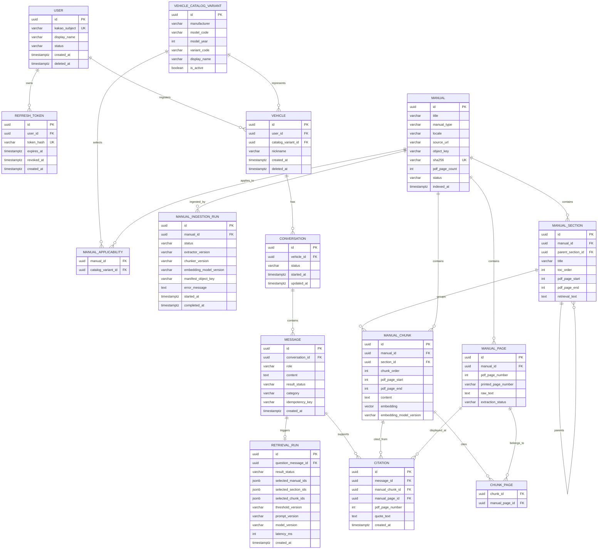

# CarMe ERD 및 데이터 사전

> 대상 DB: PostgreSQL 16 + pgvector · 모든 PK: UUID · 시간: `timestamptz`

## 1. ERD



## 2. 테이블 정의와 규칙

### 사용자·인증

| 테이블 | 목적 | 주요 규칙 |
|---|---|---|
| `user` | 카카오 로그인 사용자 | `kakao_subject` UNIQUE. 전화번호·비밀번호는 보관하지 않음. `deleted_at`은 soft delete 용도 |
| `refresh_token` | 회전 가능한 로그인 세션 | 토큰 원문 대신 해시만 저장. 폐기·만료된 토큰은 재사용 불가 |

### 차량과 매뉴얼 적용 범위

| 테이블 | 목적 | 주요 규칙 |
|---|---|---|
| `vehicle_catalog_variant` | 사용자가 선택할 수 있는 매뉴얼 적용 단위 | `(manufacturer, model_code, model_year, variant_code)` UNIQUE. 세부 옵션·트림 테이블이 아님 |
| `vehicle` | 사용자가 등록한 차량 | `user_id`, `catalog_variant_id` FK. 사용자 소유 리소스의 인가 기준 |
| `manual` | 원본 PDF 한 버전 | `sha256` UNIQUE, `object_key`는 private S3 위치. 상태는 `UPLOADED`, `INDEXING`, `READY`, `FAILED`, `ARCHIVED` |
| `manual_applicability` | 차량 선택값과 매뉴얼의 다대다 매핑 | PK/UNIQUE는 `(manual_id, catalog_variant_id)`. 하나의 차량에 여러 문서 적용 가능 |
| `manual_ingestion_run` | 적재 실행 감사 로그 | 실패 원인·도구 버전·S3 manifest를 기록. `READY` 전환 전 검증 근거 |

### 매뉴얼 검색 데이터

| 테이블 | 목적 | 주요 규칙 |
|---|---|---|
| `manual_section` | 목차/제목 기반 1차 검색 단위 | 자기참조 `parent_section_id`로 목차 계층 표현. `pdf_page_start <= pdf_page_end` |
| `manual_page` | 원본 PDF 물리 페이지 | `(manual_id, pdf_page_number)` UNIQUE. `printed_page_number`는 nullable |
| `manual_chunk` | RAG 2차 검색 단위 | 하나의 section에 속하며 여러 PDF 페이지를 걸칠 수 있음. `embedding`은 pgvector 컬럼 |
| `chunk_page` | 청크와 원본 페이지 연결 | PK/UNIQUE는 `(chunk_id, manual_page_id)`. citation의 페이지 추적 근거 |

### 상담·근거·관측 데이터

| 테이블 | 목적 | 주요 규칙 |
|---|---|---|
| `conversation` | 한 차량에 대한 상담 세션 | 사용자 ID를 중복 저장하지 않고 vehicle을 통해 소유자를 판단 |
| `message` | 고객 질문과 시스템 응답 | `role`: `USER`, `ASSISTANT`, `SYSTEM`. assistant만 `result_status`를 가질 수 있음 |
| `citation` | assistant 답변의 원문 근거 | `quote_text`는 `manual_chunk.content`의 실제 substring이어야 함 |
| `retrieval_run` | 질문별 검색 실행 기록 | `question_message_id` UNIQUE. 검색 매뉴얼·섹션·청크 ID와 임계값/모델/지연시간 기록 |

## 3. 필수 제약과 인덱스

### 제약

```text
vehicle_catalog_variant: UNIQUE(manufacturer, model_code, model_year, variant_code)
vehicle: UNIQUE(user_id, catalog_variant_id) WHERE deleted_at IS NULL
manual: UNIQUE(sha256)
manual_applicability: UNIQUE(manual_id, catalog_variant_id)
manual_page: UNIQUE(manual_id, pdf_page_number)
chunk_page: UNIQUE(chunk_id, manual_page_id)
refresh_token: UNIQUE(token_hash)
message: UNIQUE(conversation_id, idempotency_key) WHERE idempotency_key IS NOT NULL
retrieval_run: UNIQUE(question_message_id)
```

### 인덱스

```text
vehicle(user_id) WHERE deleted_at IS NULL
conversation(vehicle_id, updated_at DESC)
message(conversation_id, created_at)
manual_applicability(catalog_variant_id, manual_id)
manual(status, manual_type, locale)
manual_section(manual_id, toc_order)
manual_chunk(manual_id, section_id, chunk_order)
manual_page(manual_id, pdf_page_number)
citation(message_id)
```

임베딩 인덱스는 데이터가 적은 초기에는 exact search로 시작한다. 매뉴얼과 청크가 충분히 늘고 성능 측정이 끝난 후 cosine distance 기준 HNSW를 추가한다.

```sql
CREATE EXTENSION IF NOT EXISTS vector;
CREATE INDEX manual_chunk_embedding_hnsw
  ON manual_chunk USING hnsw (embedding vector_cosine_ops);
```

## 4. 삭제·보존 규칙

- `vehicle` 삭제는 soft delete다. 해당 차량의 conversation은 일반 API에서 조회하지 않는다.
- 사용자 삭제 요청 시 refresh token을 즉시 폐기하고, 차량·대화·메시지·citation은 보존 정책 기한 안에 삭제한다.
- `manual`은 사용자 데이터가 아니므로 계정 삭제와 무관하다. 저작물 이용 정책 종료 또는 source 교체 시 `ARCHIVED` 후 private object를 삭제한다.
- `manual`·`manual_page`·`manual_chunk`은 citation 재현성을 위해 원본 문서를 삭제하기 전까지 수정하지 않는다. 새 파일은 새 `manual` 레코드로 적재한다.
