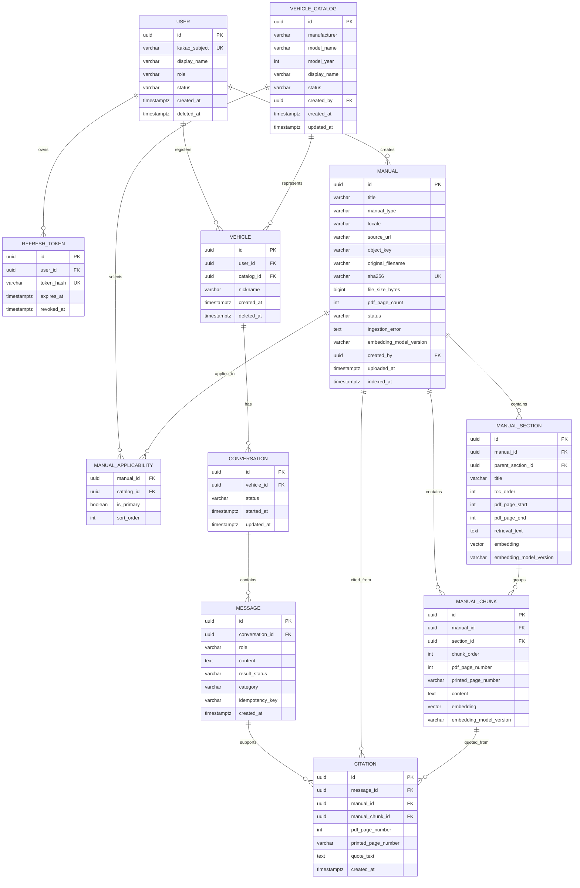

# CarMe 초기 MVP ERD 및 데이터 사전

> PostgreSQL 16 + pgvector · 모든 PK는 UUID · 시간은 `timestamptz`
> 초기 MVP는 **11개 테이블**만 사용한다. 적재 실행 이력, 검색 분석 이력, 감사 로그, 모델-연식 분리는 운영 규모가 커진 뒤 추가한다.

## 1. ERD



## 2. 한글 ERD 명세

### 2.1 관계 요약

| 부모 테이블 | 자식 테이블 | 관계 | 의미 |
|---|---|---|---|
| `user` | `refresh_token` | 1 : N | 한 사용자는 여러 로그인 기기의 refresh token을 가질 수 있다. |
| `user` | `vehicle` | 1 : N | 한 사용자는 여러 차량을 등록할 수 있다. |
| `user` | `manual` | 1 : N | 한 관리자는 여러 매뉴얼 초안을 만들 수 있다. 일반 사용자는 만들 수 없다. |
| `vehicle_catalog` | `vehicle` | 1 : N | 같은 `아반떼 2025` 카탈로그를 여러 사용자가 자기 차량으로 등록할 수 있다. |
| `vehicle_catalog` | `manual_applicability` | 1 : N | 한 차량 카탈로그에는 여러 종류의 매뉴얼을 연결할 수 있다. |
| `manual` | `manual_applicability` | 1 : N | 하나의 매뉴얼은 여러 차량 카탈로그에 적용될 수 있다. |
| `manual` | `manual_section` | 1 : N | 한 PDF에서 여러 목차 섹션을 추출한다. |
| `manual` | `manual_chunk` | 1 : N | 한 PDF에서 페이지 단위 의미 청크를 여러 개 만든다. |
| `manual_section` | `manual_chunk` | 1 : N | 한 목차 섹션은 여러 페이지/청크를 포함한다. |
| `vehicle` | `conversation` | 1 : N | 등록 차량마다 상담방을 여러 개 가질 수 있다. |
| `conversation` | `message` | 1 : N | 상담방에는 사용자 질문과 assistant 답변이 시간순으로 저장된다. |
| `message` | `citation` | 1 : N | 하나의 답변은 여러 PDF 페이지를 근거로 둘 수 있다. |
| `manual` / `manual_chunk` | `citation` | 1 : N | citation은 어느 매뉴얼의 어느 청크·페이지인지 고정해 저장한다. |

`manual_applicability`는 차량 카탈로그와 매뉴얼의 N:M 관계를 풀어 주는 연결 테이블이다. 이 연결이 있어야 한 차량에 취급설명서와 인포테인먼트 매뉴얼을 함께 적용할 수 있다.

### 2.2 `user` — 사용자 및 관리자 계정

카카오 로그인으로 생성되는 서비스 계정이다. `role`로 일반 사용자와 관리자를 구분한다.

| 속성 | 타입 | 필수 | 설명 및 규칙 |
|---|---|---:|---|
| `id` | UUID | 예 | PK. 서비스 내부 사용자 식별자. |
| `kakao_subject` | varchar | 예 | 카카오가 제공하는 사용자 고유 식별자. UNIQUE. |
| `display_name` | varchar | 예 | 서비스에 표시할 이름. |
| `role` | varchar | 예 | `USER` 또는 `ADMIN`. 일반 API로 변경할 수 없다. |
| `status` | varchar | 예 | 계정 사용 상태. 초기값은 `ACTIVE`; 정지/삭제 계정은 인증·인가에서 차단한다. |
| `created_at` | timestamptz | 예 | 계정 생성 시각. |
| `deleted_at` | timestamptz | 아니오 | 계정 삭제 요청 처리 시각. soft delete 용도. |

관계: `refresh_token`, `vehicle`, `manual.created_by`의 부모다.

### 2.3 `refresh_token` — 로그인 세션

access JWT를 재발급하기 위한 서버 측 로그인 세션이다.

| 속성 | 타입 | 필수 | 설명 및 규칙 |
|---|---|---:|---|
| `id` | UUID | 예 | PK. |
| `user_id` | UUID | 예 | `user.id` FK. 토큰 소유자. |
| `token_hash` | varchar | 예 | refresh token 원문이 아닌 해시. UNIQUE. |
| `expires_at` | timestamptz | 예 | 재발급 가능한 만료 시각. |
| `revoked_at` | timestamptz | 아니오 | 로그아웃·탈취 의심 시 폐기한 시각. |

관계: 하나의 `user`에 여러 개가 가능하다. 삭제된 사용자나 폐기·만료 토큰은 사용할 수 없다.

### 2.4 `vehicle_catalog` — 등록 가능한 차량 카탈로그

관리자가 만드는 서비스 공통 차량 목록이다. **한 행에 차종과 연식을 각각 저장**한다.

| 속성 | 타입 | 필수 | 설명 및 규칙 |
|---|---|---:|---|
| `id` | UUID | 예 | PK. API가 차량 선택값으로 사용하는 식별자. |
| `manufacturer` | varchar | 예 | 초기값은 `HYUNDAI`. |
| `model_name` | varchar | 예 | 차종명. 예: `아반떼`. |
| `model_year` | int | 예 | 연식. 예: `2025`. |
| `display_name` | varchar | 예 | 화면 표시명. 서버가 `model_name + 공백 + model_year`로 생성한다. 예: `아반떼 2025`. |
| `status` | varchar | 예 | `DRAFT`, `ACTIVE`, `ARCHIVED`. `ACTIVE`만 일반 사용자 선택 목록에 노출한다. |
| `created_by` | UUID | 예 | `user.id` FK. 생성한 관리자. |
| `created_at` | timestamptz | 예 | 생성 시각. |
| `updated_at` | timestamptz | 예 | 마지막 수정 시각. |

제약: `UNIQUE(manufacturer, model_name, model_year)`. 따라서 `아반떼/2025`와 `아반떼/2026`은 서로 다른 두 행이다.

관계: `vehicle`과 `manual_applicability`의 부모다. 공개 전에는 기본 매뉴얼(`is_primary = true`) 한 개가 `READY`인지 검사한다.

### 2.5 `vehicle` — 사용자가 등록한 내 차량

실제 차량의 상세 사양이 아니라 사용자가 고른 카탈로그와 별칭만 저장한다. 옵션·트림·차대번호는 저장하지 않는다.

| 속성 | 타입 | 필수 | 설명 및 규칙 |
|---|---|---:|---|
| `id` | UUID | 예 | PK. 사용자 차량 및 상담 소유권 판단 기준. |
| `user_id` | UUID | 예 | `user.id` FK. 차량 소유자. |
| `catalog_id` | UUID | 예 | `vehicle_catalog.id` FK. 예: 아반떼 2025. |
| `nickname` | varchar | 예 | 사용자 별칭. 예: `우리 차`. |
| `created_at` | timestamptz | 예 | 등록 시각. |
| `deleted_at` | timestamptz | 아니오 | 삭제 시각. soft delete. |

제약: `UNIQUE(user_id, catalog_id) WHERE deleted_at IS NULL`. 같은 사용자는 같은 차종·연식을 한 번만 등록한다.

관계: `conversation`의 부모다. API 인가는 `conversation → vehicle → user`로 확인한다.

### 2.6 `manual` — 원본 PDF 한 버전

S3/MinIO private bucket에 보관한 PDF 한 파일의 메타데이터와 적재 상태다. PDF 개정본은 기존 행을 수정하지 않고 새 행으로 만든다.

| 속성 | 타입 | 필수 | 설명 및 규칙 |
|---|---|---:|---|
| `id` | UUID | 예 | PK. |
| `title` | varchar | 예 | 화면 표시용 문서명. 예: `아반떼 2025 취급설명서`. |
| `manual_type` | varchar | 예 | 예: `OWNER_MANUAL`, `INFOTAINMENT_MANUAL`. |
| `locale` | varchar | 예 | 문서 언어. 예: `ko-KR`. |
| `source_url` | varchar | 아니오 | 원본 출처 확인용 URL. 일반 사용자에게 반드시 노출하지 않는다. |
| `object_key` | varchar | 예 | private S3/MinIO의 내부 객체 위치. API/UI에 노출하지 않는다. |
| `original_filename` | varchar | 예 | 업로드 당시 PDF 파일명. |
| `sha256` | varchar | 예 | PDF 내용 해시. UNIQUE로 중복 파일을 막는다. |
| `file_size_bytes` | bigint | 예 | 서버가 검증한 파일 크기. |
| `pdf_page_count` | int | 예 | 서버가 검증한 PDF 물리 페이지 수. |
| `status` | varchar | 예 | `DRAFT`, `UPLOADED`, `INDEXING`, `READY`, `FAILED`, `ARCHIVED`. |
| `ingestion_error` | text | 아니오 | 적재 실패 시 안전하게 기록한 오류 요약. |
| `embedding_model_version` | varchar | 아니오 | 현재 청크에 사용한 임베딩 모델 버전. |
| `created_by` | UUID | 예 | `user.id` FK. 초안을 만든 관리자. |
| `uploaded_at` | timestamptz | 아니오 | PDF 검증 업로드 완료 시각. |
| `indexed_at` | timestamptz | 아니오 | 섹션·청크·임베딩 생성 완료 시각. |

관계: `manual_applicability`, `manual_section`, `manual_chunk`, `citation`의 부모다. `READY` 문서만 RAG 검색과 사용자 PDF 다운로드에 쓴다.

### 2.7 `manual_applicability` — 차량과 매뉴얼 연결

어떤 차량 카탈로그가 어떤 문서를 검색·다운로드할 수 있는지 결정한다. 이 테이블이 차량 선택과 RAG 문서 범위를 연결한다.

| 속성 | 타입 | 필수 | 설명 및 규칙 |
|---|---|---:|---|
| `manual_id` | UUID | 예 | `manual.id` FK. 복합 PK/UNIQUE 구성 요소. |
| `catalog_id` | UUID | 예 | `vehicle_catalog.id` FK. 복합 PK/UNIQUE 구성 요소. |
| `is_primary` | boolean | 예 | 기본 취급설명서 여부. 카탈로그당 `true`는 최대 한 개. |
| `sort_order` | int | 예 | 여러 문서를 보여 줄 때의 정렬 순서. |

제약: `UNIQUE(manual_id, catalog_id)`, `UNIQUE(catalog_id) WHERE is_primary = true`.

관계: `vehicle_catalog`과 `manual`의 N:M 관계를 표현한다. 질문 시 `vehicle.catalog_id`로 이 테이블을 조회하고 `manual.status = READY`를 함께 필터링한다.

### 2.8 `manual_section` — 목차 섹션

PDF 목차와 본문 제목에서 추출한 1차 검색 단위다. RAG가 먼저 관련 목차 범위를 좁히는 데 사용한다.

| 속성 | 타입 | 필수 | 설명 및 규칙 |
|---|---|---:|---|
| `id` | UUID | 예 | PK. |
| `manual_id` | UUID | 예 | `manual.id` FK. |
| `parent_section_id` | UUID | 아니오 | 같은 테이블의 `id` FK. 상위 목차가 없으면 NULL. |
| `title` | varchar | 예 | 목차 제목. 예: `주차 브레이크`. |
| `toc_order` | int | 예 | 문서 내 목차 순서. |
| `pdf_page_start` | int | 예 | 섹션 시작 PDF 물리 페이지. |
| `pdf_page_end` | int | 예 | 섹션 종료 PDF 물리 페이지. |
| `retrieval_text` | text | 예 | 제목·breadcrumb·요약을 합친 검색용 텍스트. |
| `embedding` | vector | 예 | 1차 목차 검색용 벡터. |
| `embedding_model_version` | varchar | 예 | section 임베딩 생성에 사용한 모델 버전. |

제약: `UNIQUE(manual_id, toc_order)`, `pdf_page_start <= pdf_page_end`.

관계: 한 `manual`에 속하며, 자기참조로 목차 계층을 만들고 여러 `manual_chunk`의 부모가 된다.

### 2.9 `manual_chunk` — RAG 페이지 청크

LLM에 전달할 실제 원문 검색 단위다. **청크 하나는 반드시 PDF 물리 페이지 하나 안에만** 존재한다.

| 속성 | 타입 | 필수 | 설명 및 규칙 |
|---|---|---:|---|
| `id` | UUID | 예 | PK. |
| `manual_id` | UUID | 예 | `manual.id` FK. 검색 범위 필터에 사용. |
| `section_id` | UUID | 예 | `manual_section.id` FK. 1차 목차 검색 결과에 연결. |
| `chunk_order` | int | 예 | 같은 문서 내 청크 순서. |
| `pdf_page_number` | int | 예 | PDF 뷰어의 물리 페이지 번호(1부터 시작). citation의 기준 페이지. |
| `printed_page_number` | varchar | 아니오 | PDF 본문에 인쇄된 페이지 번호. 예: `5-23`. |
| `content` | text | 예 | 추출한 원문 텍스트. citation quote의 원천. |
| `embedding` | vector | 예 | 2차 의미 검색용 벡터. |
| `embedding_model_version` | varchar | 예 | 청크 임베딩 모델 버전. |

제약: 같은 청크가 여러 페이지를 가질 수 없다. 긴 페이지는 여러 청크로 나누되 모두 같은 `pdf_page_number`를 갖는다.

관계: 한 `manual`, 한 `manual_section`에 속한다. `citation`은 이 청크의 실제 substring만 인용할 수 있다.

### 2.10 `conversation` — 상담방

사용자가 선택한 내 차량에 대해 시작한 상담 세션이다.

| 속성 | 타입 | 필수 | 설명 및 규칙 |
|---|---|---:|---|
| `id` | UUID | 예 | PK. |
| `vehicle_id` | UUID | 예 | `vehicle.id` FK. 상담의 차량 문맥과 소유권 기준. |
| `status` | varchar | 예 | 예: `OPEN`, `CLOSED`. 초기값은 `OPEN`. |
| `started_at` | timestamptz | 예 | 상담방 생성 시각. |
| `updated_at` | timestamptz | 예 | 마지막 메시지 처리 시각. |

관계: 한 `vehicle`에 속하고 여러 `message`를 갖는다. 초기 MVP는 매뉴얼 스냅샷 테이블을 두지 않아, 새 질문 때 현재 적용된 `READY` 매뉴얼을 조회한다.

### 2.11 `message` — 상담 메시지

사용자의 질문과 assistant의 응답을 같은 시간순 목록에 저장한다.

| 속성 | 타입 | 필수 | 설명 및 규칙 |
|---|---|---:|---|
| `id` | UUID | 예 | PK. |
| `conversation_id` | UUID | 예 | `conversation.id` FK. |
| `role` | varchar | 예 | `USER`, `ASSISTANT`, 필요 시 `SYSTEM`. |
| `content` | text | 예 | 질문 또는 답변 텍스트. 근거 부족 상태의 assistant 답변은 안내 문구만 저장한다. |
| `result_status` | varchar | 아니오 | assistant 결과: `GROUNDED`, `AMBIGUOUS`, `INSUFFICIENT_EVIDENCE`, `SAFETY_ESCALATION`. USER 메시지는 NULL. |
| `category` | varchar | 아니오 | 사용자가 고른 증상 카테고리. 검색 강제 필터가 아니다. |
| `idempotency_key` | varchar | 아니오 | 질문 전송 중복 방지 키. |
| `created_at` | timestamptz | 예 | 생성 시각. |

제약: `UNIQUE(conversation_id, idempotency_key) WHERE idempotency_key IS NOT NULL`.

관계: 한 `conversation`에 속한다. `ASSISTANT` 메시지만 여러 `citation`을 가질 수 있다.

### 2.12 `citation` — 답변 근거

assistant 답변이 어떤 매뉴얼의 어느 PDF 페이지와 원문 문구를 근거로 했는지 보관한다.

| 속성 | 타입 | 필수 | 설명 및 규칙 |
|---|---|---:|---|
| `id` | UUID | 예 | PK. |
| `message_id` | UUID | 예 | `message.id` FK. assistant 답변 메시지. |
| `manual_id` | UUID | 예 | `manual.id` FK. 인용 문서. |
| `manual_chunk_id` | UUID | 예 | `manual_chunk.id` FK. 인용 원문이 있는 청크. |
| `pdf_page_number` | int | 예 | backend가 청크에서 복사한 PDF 물리 페이지. LLM이 직접 만들지 않는다. |
| `printed_page_number` | varchar | 아니오 | backend가 청크에서 복사한 본문 인쇄 페이지. |
| `quote_text` | text | 예 | `manual_chunk.content`의 실제 substring만 저장. |
| `created_at` | timestamptz | 예 | citation 생성 시각. |

관계: `message`, `manual`, `manual_chunk`을 연결한다. 화면은 이 정보로 `취급설명서 · PDF 146쪽`과 원문 보기 버튼을 만든다.

## 3. 테이블별 책임 요약

| 테이블 | 초기 MVP에서 필요한 이유 | 핵심 규칙 |
|---|---|---|
| `user` | 로그인 사용자와 관리자 권한 | `role`은 `USER`/`ADMIN`; 역할 변경 API 없음 |
| `refresh_token` | 카카오 로그인 세션 갱신 | 원문이 아닌 해시 저장 |
| `vehicle_catalog` | 사용자가 고르는 차량 단위 | `model_name = 아반떼`, `model_year = 2025`를 별도 속성으로 저장하고 화면용 `display_name`을 생성; 세부 옵션·트림 없음 |
| `vehicle` | 사용자가 등록한 내 차량 | `user_id`와 `catalog_id`로 소유·차종 연결 |
| `manual` | PDF 한 버전과 S3 적재 상태 | `DRAFT → UPLOADED → INDEXING → READY/FAILED → ARCHIVED` |
| `manual_applicability` | 차량과 매뉴얼의 연결 | 한 차량에 취급설명서·인포테인먼트 문서를 함께 연결 가능 |
| `manual_section` | 목차 기반 1차 RAG 검색 | 계층 목차와 PDF 페이지 범위 저장 |
| `manual_chunk` | 페이지 근거와 벡터 검색 | **PDF/인쇄 페이지 번호를 직접 저장**; `manual_page` 없음 |
| `conversation` | 한 차량의 상담방 | 초기에는 매뉴얼 스냅샷을 만들지 않음 |
| `message` | 질문·답변과 답변 상태 | `GROUNDED` 등 결과 상태 저장 |
| `citation` | 답변의 원문 근거 | `manual_id`, chunk, PDF/인쇄 쪽수를 저장 |

## 4. 차량 카탈로그 규칙

```text
vehicle_catalog
────────────────────────────────────────────
manufacturer: HYUNDAI
model_name: 아반떼
model_year: 2025
display_name: 아반떼 2025
status: DRAFT | ACTIVE | ARCHIVED
```

- 관리자는 `model_name`, `model_year`만 입력한다. 서버가 `display_name = "{model_name} {model_year}"`를 생성한다.
- `아반떼 2025`, `아반떼 2026`은 서로 다른 행이므로 별도 `vehicle_catalog_model` 테이블이 필요 없다.
- 초기에는 하이브리드·N Line 등의 별도 변형을 받지 않는다. 같은 모델·연식에서 서로 다른 매뉴얼을 반드시 구분해야 할 때만 `vehicle_catalog_variant`를 추가한다.
- 일반 사용자에게는 `ACTIVE`이며 기본 `READY` 매뉴얼이 연결된 행만 노출한다.

## 5. 제약과 인덱스

### 제약

```text
vehicle_catalog: UNIQUE(manufacturer, model_name, model_year)
vehicle: UNIQUE(user_id, catalog_id) WHERE deleted_at IS NULL
manual: UNIQUE(sha256)
manual_applicability: UNIQUE(manual_id, catalog_id)
manual_applicability: UNIQUE(catalog_id) WHERE is_primary = true
manual_section: UNIQUE(manual_id, toc_order)
message: UNIQUE(conversation_id, idempotency_key) WHERE idempotency_key IS NOT NULL
refresh_token: UNIQUE(token_hash)
```

기본 매뉴얼을 교체할 때는 하나의 transaction에서 이전 `is_primary`를 해제하고 새 연결을 지정한다.

### 인덱스

```text
vehicle_catalog(status, manufacturer, model_name, model_year)
vehicle(user_id) WHERE deleted_at IS NULL
manual(status, manual_type, locale)
manual_applicability(catalog_id, manual_id)
manual_section(manual_id, toc_order)
manual_chunk(manual_id, section_id, pdf_page_number, chunk_order)
conversation(vehicle_id, updated_at DESC)
message(conversation_id, created_at)
citation(message_id)
```

임베딩은 데이터가 적은 초기에는 exact search로 시작하고, 데이터·성능 측정 후 HNSW를 추가한다.

```sql
CREATE EXTENSION IF NOT EXISTS vector;
CREATE INDEX manual_chunk_embedding_hnsw
  ON manual_chunk USING hnsw (embedding vector_cosine_ops);
```

## 6. 초기 MVP에서 보류한 테이블

| 보류 | 초기 처리 | 추가 시점 |
|---|---|---|
| `vehicle_catalog_model` | `vehicle_catalog.model_name`, `model_year` 한 행 | 모델 공통 정보/여러 변형을 따로 관리할 때 |
| `manual_page` | chunk의 페이지 번호 사용 | 페이지별 OCR 상태·전체 원문 조회 필요 시 |
| `manual_ingestion_run` | `manual.status`, `ingestion_error`, worker 로그 | 재시도 이력·모델 버전 비교 필요 시 |
| `conversation_manual` | 질문 때 차량의 현재 `READY` 매뉴얼 결정 | 매뉴얼 개정 뒤 대화 검색 범위 고정 필요 시 |
| `retrieval_run` | 구조화 애플리케이션 로그와 평가 JSON | 임계값 A/B 실험/운영 분석 시 |
| `admin_audit_log` | 관리자 변경을 구조화 로그에 기록 | 여러 운영자·승인·규정 감사 시 |

## 7. 보존·권한 규칙

- `vehicle`은 soft delete다.
- 개정 PDF는 새 `manual`로 적재하며, `READY` 문서의 청크를 덮어쓰지 않는다.
- `citation`은 답변 당시 `manual_id`, chunk, 페이지를 저장한다. PDF 보관 기간은 운영 정책으로 정한다.
- 관리자 권한은 DB 초기화/운영 절차로만 부여한다. 일반 사용자의 `/admin/*` 접근은 `403`이다.
