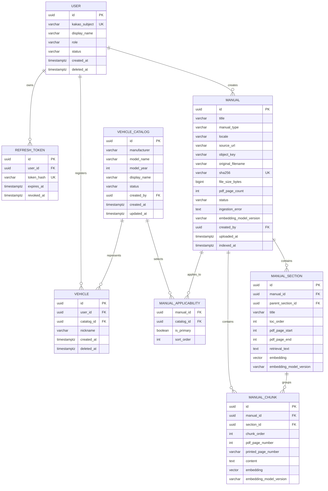

# CarMe 초기 MVP ERD 및 데이터 사전

> PostgreSQL 16 + pgvector · 모든 PK는 UUID · 시간은 `timestamptz`
>
> 초기 MVP의 영구 DB 테이블은 **8개**다. 채팅방, 질문, 답변, citation은 DB에 저장하지 않는다. 이들은 API 프로세스 메모리의 단기 세션에만 존재하며, 나가거나 만료·재시작되면 사라진다.

## 1. ERD



## 2. 한글 ERD 명세

### 2.1 관계 요약

| 부모 | 자식 | 관계 | 의미 |
|---|---|---|---|
| `user` | `refresh_token` | 1:N | 사용자별 로그인 세션 갱신 토큰 |
| `user` | `vehicle` | 1:N | 사용자가 등록한 차량 |
| `user` | `manual` | 1:N | 관리자가 만든 매뉴얼 초안 |
| `vehicle_catalog` | `vehicle` | 1:N | 공통 차종·연식 카탈로그와 내 차량 연결 |
| `vehicle_catalog` / `manual` | `manual_applicability` | N:M | 해당 차량에 적용할 매뉴얼 결정 |
| `manual` | `manual_section` / `manual_chunk` | 1:N | 목차·페이지 기반 RAG 색인 |
| `manual_section` | `manual_chunk` | 1:N | 목차 범위와 페이지 청크 연결 |

`conversation`, `message`, `citation` 테이블은 만들지 않는다. 근거 카드는 `manual_chunk`에서 요청 시 조립해 응답하고, 사용자 대화는 메모리에만 보관한다.

### 2.2 `user` — 사용자 및 관리자 계정

| 속성 | 타입 | 필수 | 설명 |
|---|---|---:|---|
| `id` | UUID | 예 | 서비스 내부 PK |
| `kakao_subject` | varchar | 예 | 카카오 고유 식별자, UNIQUE |
| `display_name` | varchar | 예 | 화면 표시 이름 |
| `role` | varchar | 예 | `USER` 또는 `ADMIN`; 공개 API로 변경 불가 |
| `status` | varchar | 예 | 기본 `ACTIVE`; 정지·삭제 계정은 차단 |
| `created_at`, `deleted_at` | timestamptz | 예/아니오 | 생성·soft delete 시각 |

### 2.3 `refresh_token` — 로그인 세션

| 속성 | 타입 | 필수 | 설명 |
|---|---|---:|---|
| `id` | UUID | 예 | PK |
| `user_id` | UUID | 예 | `user.id` FK |
| `token_hash` | varchar | 예 | 원문이 아닌 해시, UNIQUE |
| `expires_at`, `revoked_at` | timestamptz | 예/아니오 | 만료·폐기 시각 |

### 2.4 `vehicle_catalog` — 등록 가능한 차량

한 행에는 차종과 연식을 **서로 다른 속성**으로 저장한다. 예: `model_name=아반떼`, `model_year=2025`.

| 속성 | 타입 | 필수 | 설명 |
|---|---|---:|---|
| `id` | UUID | 예 | PK 및 차량 선택값 |
| `manufacturer` | varchar | 예 | 초기값 `HYUNDAI` |
| `model_name` | varchar | 예 | 예: `아반떼` |
| `model_year` | int | 예 | 예: `2025` |
| `display_name` | varchar | 예 | 서버 생성값 `아반떼 2025` |
| `status` | varchar | 예 | `DRAFT`, `ACTIVE`, `ARCHIVED` |
| `created_by`, `created_at`, `updated_at` | UUID/timestamptz | 예 | 생성 관리자와 시각 |

제약: `UNIQUE(manufacturer, model_name, model_year)`. 초기에는 트림·옵션·하이브리드 등 별도 선택값을 받지 않는다.

### 2.5 `vehicle` — 사용자가 등록한 내 차량

| 속성 | 타입 | 필수 | 설명 |
|---|---|---:|---|
| `id` | UUID | 예 | PK |
| `user_id` | UUID | 예 | 선택 차량을 등록한 계정 `user.id` FK |
| `catalog_id` | UUID | 예 | 선택한 `vehicle_catalog.id` FK |
| `nickname` | varchar | 예 | 예: `우리 차` |
| `created_at`, `deleted_at` | timestamptz | 예/아니오 | 생성·soft delete 시각 |

제약: `UNIQUE(user_id, catalog_id) WHERE deleted_at IS NULL`. 차대번호·세부 옵션은 저장하지 않는다.

### 2.6 `manual` — 원본 PDF 한 버전

private S3/MinIO에 둔 PDF 한 버전의 메타데이터와 적재 상태다. 개정본은 새 행으로 만든다.

| 속성 | 타입 | 필수 | 설명 |
|---|---|---:|---|
| `id` | UUID | 예 | PK |
| `title`, `manual_type`, `locale` | varchar | 예 | 표시명·종류·언어 |
| `source_url` | varchar | 아니오 | 출처 확인용; 일반 사용자에게 미노출 가능 |
| `object_key` | varchar | 예 | private 객체 위치; API/UI에 미노출 |
| `original_filename`, `sha256` | varchar | 예 | 원본 파일명, 내용 해시(UNIQUE) |
| `file_size_bytes`, `pdf_page_count` | bigint/int | 예 | 서버 검증값 |
| `status` | varchar | 예 | `DRAFT → UPLOADED → INDEXING → READY`, 실패 시 `FAILED`, 폐기 시 `ARCHIVED` |
| `ingestion_error` | text | 아니오 | 안전한 실패 요약 |
| `embedding_model_version` | varchar | 아니오 | 현재 색인 임베딩 버전 |
| `created_by`, `uploaded_at`, `indexed_at` | UUID/timestamptz | 예/아니오 | 생성자와 적재 시각 |

`READY`는 업로드 검증, 텍스트/목차/청크/임베딩 생성, 해당 매뉴얼 평가 세트 통과까지 끝난 상태다.

### 2.7 `manual_applicability` — 차량과 매뉴얼 연결

| 속성 | 타입 | 필수 | 설명 |
|---|---|---:|---|
| `manual_id`, `catalog_id` | UUID | 예 | `manual`, `vehicle_catalog` FK 및 복합 UNIQUE |
| `is_primary` | boolean | 예 | 기본 취급설명서 여부; 카탈로그당 true 최대 1개 |
| `sort_order` | int | 예 | 화면 문서 목록 정렬 |

질문마다 `vehicle.catalog_id`와 `manual.status=READY`로 현재 검색·다운로드 문서를 결정한다.

### 2.8 `manual_section` — 목차 섹션

| 속성 | 타입 | 필수 | 설명 |
|---|---|---:|---|
| `id`, `manual_id`, `parent_section_id` | UUID | 예/예/아니오 | PK, 매뉴얼 FK, 자기참조 상위 목차 |
| `title`, `toc_order` | varchar/int | 예 | 목차 제목과 문서 내 순서 |
| `pdf_page_start`, `pdf_page_end` | int | 예 | 섹션 PDF 물리 페이지 범위 |
| `retrieval_text`, `embedding`, `embedding_model_version` | text/vector/varchar | 예 | 1차 목차 검색 데이터 |

제약: `UNIQUE(manual_id, toc_order)`, `pdf_page_start <= pdf_page_end`.

### 2.9 `manual_chunk` — RAG 페이지 청크

| 속성 | 타입 | 필수 | 설명 |
|---|---|---:|---|
| `id`, `manual_id`, `section_id` | UUID | 예 | PK와 매뉴얼·섹션 FK |
| `chunk_order` | int | 예 | 문서 내 청크 순서 |
| `pdf_page_number` | int | 예 | PDF 물리 페이지(1부터); 근거 카드 기준 |
| `printed_page_number` | varchar | 아니오 | 본문 인쇄 쪽수 |
| `content` | text | 예 | 실제 원문 |
| `embedding`, `embedding_model_version` | vector/varchar | 예 | 2차 검색 데이터 |

청크는 한 PDF 물리 페이지를 넘지 않는다. 답변 근거의 `quote_text`, PDF/인쇄 페이지는 이 행에서 즉시 만든다.

## 3. 비영구 채팅 세션(ERD 밖)

LangChain `InMemoryChatMessageHistory`와 서버 `SessionStore`가 프로세스 RAM에 아래 값만 유지한다.

| 값 | 용도 | 보존 |
|---|---|---|
| `session_id` | 예측 불가능한 UUID, API 경로 식별 | 브라우저 이탈·명시적 종료·idle TTL·프로세스 재시작까지 |
| `user_id`, `vehicle_id` | 세션 접근 권한·선택 차량 검증 | 같은 기간 |
| `history` | 최근 최대 4개 메시지/2,000 토큰 | 같은 기간; DB 미저장 |
| `created_at`, `last_accessed_at`, `expires_at` | TTL 관리 | 같은 기간 |

기본 idle TTL은 30분이다. `DELETE /chat-sessions/{sessionId}`는 즉시 제거한다. 새 질문마다 현 시점의 `READY` 매뉴얼을 다시 결정하므로, 세션은 매뉴얼 스냅샷도 만들지 않는다. 단일 프로세스/단일 worker MVP이며 재시작, 배포, 다중 replica에서는 세션이 이어지지 않는다.

## 4. 테이블별 책임 요약

| 테이블 | 책임 |
|---|---|
| `user`, `refresh_token` | 카카오 계정·로그인 갱신 |
| `vehicle_catalog`, `vehicle` | 모델+연식 선택과 사용자별 선택 차량 항목 |
| `manual`, `manual_applicability` | PDF 버전·상태와 차량별 적용 범위 |
| `manual_section`, `manual_chunk` | 목차→페이지 RAG 검색과 실시간 근거 |

## 5. 제약과 인덱스

```text
vehicle_catalog: UNIQUE(manufacturer, model_name, model_year)
vehicle: UNIQUE(user_id, catalog_id) WHERE deleted_at IS NULL
manual: UNIQUE(sha256)
manual_applicability: UNIQUE(manual_id, catalog_id)
manual_applicability: UNIQUE(catalog_id) WHERE is_primary = true
manual_section: UNIQUE(manual_id, toc_order)
refresh_token: UNIQUE(token_hash)
```

```text
vehicle_catalog(status, manufacturer, model_name, model_year)
vehicle(user_id) WHERE deleted_at IS NULL
manual(status, manual_type, locale)
manual_applicability(catalog_id, manual_id)
manual_section(manual_id, toc_order)
manual_chunk(manual_id, section_id, pdf_page_number, chunk_order)
```

`manual_section.embedding`, `manual_chunk.embedding`은 초기에는 `qwen3-embedding:4b`의 **1,024차원**으로 생성하고 정확 최근접 검색을 쓴다. 모델 버전·차원이 달라질 때는 기존 벡터와 섞지 않고 전체 재색인한다. 문서·지연시간 평가 후 HNSW 인덱스를 도입한다.
