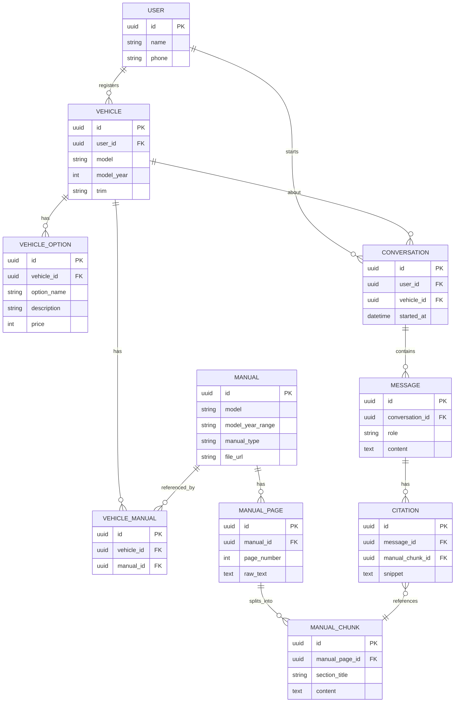

# 현대차 매뉴얼 기반 RAG 상담 서비스 — 설계 정리

## 1. 서비스 개요

- **문제 상황**: 현대차 영업직원이 받는 고객 전화의 상당수가 "차량이 뭐가 안 된다"는 증상 위주 문의. 원인을 모른 채 증상만 듣고 해결책을 즉시 제공하기 어려움. 특히 고령 고객 등은 홈페이지의 세부 매뉴얼을 직접 찾아보지 않음.
- **해결 방향**: 사용자가 자신의 차량을 등록하면, 해당 차종의 매뉴얼을 RAG로 검색해 증상에 맞는 해결책을 근거 문서(문서명 + 페이지 번호)와 함께 제시.
- **실사용 주체**: 고객이 직접 쓰는 셀프서비스 앱.
- **핵심 차별점**: 답변에 반드시 근거(문서 + 페이지)를 첨부 → hallucination 방지, 검증 가능한 답변. 근거가 없으면 "모른다 + 상담원 연결"로 폴백.

## 2. 스코프 결정 사항

| 결정 | 내용 |
|---|---|
| 메모리 범위 | 장기 메모리(세션 간 개인화) 없음. 세션 내 최근 메시지만 컨텍스트로 사용. 히스토리 화면은 별도의 기록용 저장(LLM 재입력용 아님) |
| 대상 차종 | 2~3개 모델로 한정. 코드 구조는 확장 가능하게(`TARGET_MODELS` 리스트) 설계, 실행만 최소 범위 |
| 외부 API | 현대차 공식/서드파티 API 모두 핵심 기능에 불필요. 차량 등록은 정적 드롭다운(차종/연식/트림) 선택 방식 |
| (선택) 부가기능 | Smartcar 시뮬레이션 모드로 "실시간 차량 상태" 카드 추가 가능 — 핵심 스코프 아님, 여유 있을 때만 |

## 3. 문서 소스

### 3-1. 취급설명서(사용설명서) — RAG 대상 (증상 대응용)
- 출처: `https://ownersmanual.hyundai.com/full_pdf/{모델코드}/{연식}/ko_KR`
- 확인된 사례: `CE1/2025`, `NE1/2026`, `LX3HEV/2026`, `ME/2027` 등에서 실제 국문 PDF 확인됨
- 아반떼 = `CN7`로 추정(중고차 매물 사이트 등에서 통용되는 표기) — **직접 URL 접속해서 검증 필요**
- 과제: 상용 모델명 ↔ 내부 모델코드 매핑표를 대상 모델 2~3개에 대해 직접 구축해야 함

### 3-2. 카탈로그/가격표 — 구조화 데이터 대상 (가격·옵션 정보용)
- 출처: `https://www.hyundai.com/kr/ko/e/vehicles/catalog-price-download`
- 모델별 다운로드 링크가 JS로 동적 로딩되어 단순 요청으로는 전체 목록 확보 불가 → 헤드리스 브라우저(Playwright 등) 필요할 수 있음. 3일 일정에서 시간이 걸릴 수 있는 지점

### 3-3. 소스별 처리 방식 구분
- "네비게이션이 안 켜져요" 같은 증상형 질문 → RAG(의미 검색)
- "이 옵션 얼마예요?" 같은 정확한 사실 조회 → 구조화 테이블(`VEHICLE_OPTION`) 정확 매칭
- "이 옵션이 뭐 하는 기능이에요?" 같은 설명형 질문 → RAG

## 4. 데이터 처리 파이프라인

1. PDF 파일 자체를 정적 스토리지에 저장 (페이지 이미지 래스터화는 하지 않음). DB에는 `file_url`(경로)만 저장
2. 페이지별 텍스트 추출 — PyMuPDF 등으로 페이지 번호 유지
3. 청킹 — PDF 내장 목차(TOC/북마크, `doc.get_toc()`)가 있으면 섹션 단위로 우선 청킹, 없으면 폰트 헤딩 감지나 고정 길이로 폴백
4. 임베딩 — BGE-M3
5. 벡터 검색
   - FAISS: 매뉴얼별 개별 인덱스. 한 차량에 연결된 여러 매뉴얼의 인덱스를 각각 검색 후 유사도 기준으로 결과를 머지
   - Elasticsearch: `manual_id IN [...]` term filter로 다중 매뉴얼 검색을 한 번에 처리 (구현이 더 간단)
6. 검색 범위 제한 — 사용자가 등록한 차량에 연결된 매뉴얼(`VEHICLE_MANUAL` 조인)로만 필터링. 차량 등록 시점에 (모델+연식+트림) 매칭 쿼리로 미리 계산해 `VEHICLE_MANUAL`에 저장 (실시간 매칭 로직 없이 즉시 조회)
7. 답변 생성 — LangChain 단순 체인으로 MVP 우선. 시간이 남으면 LangGraph로 (a) 모호한 질문 되묻기 (b) 검색 결과 신뢰도 낮을 때 재검색 (c) 근거 없을 때 상담원 연결, 3개 분기만 확장
8. Hallucination 방지 — 검색된 청크 범위 안에서만 답변하도록 프롬프트 제약. 근거 없으면 무조건 "모른다 + 상담원 연결" 폴백

## 5. 시스템 아키텍처

- **Spring Boot**: 회원/차량/대화 CRUD, 인증·인가 (동아리 관리 서비스에서 구현한 로그인·세션 관리 패턴 재사용, 이번엔 역할 계층 불필요)
- **Python RAG 서비스**: 임베딩, 벡터 검색, LangChain/LangGraph — Spring Boot가 REST로 내부 호출
- **인증**: JWT (서비스 간 인증 전달이 세션보다 간단)
- **인가**: 모든 리소스 접근 시 요청자의 `user_id`와 리소스 소유 `user_id` 일치 검증 필수 — 다른 사용자의 차량·대화 정보 접근 차단

## 6. ERD



**설계 포인트**
- `MANUAL_PAGE`와 `MANUAL_CHUNK`를 분리한 이유: 한 페이지에 청크가 여러 개 나올 수 있어 "검색 단위(청크)"와 "원본 참조 단위(페이지)"를 분리
- `VEHICLE_MANUAL`을 다대다 조인 테이블로 둔 이유: 한 차량이 사용설명서·내비게이션 매뉴얼 등 여러 문서를 참조할 수 있음
- `VEHICLE_OPTION.price`: 가격은 RAG가 아니라 이 필드에서 정확 매칭으로 조회

## 7. API 명세서

| Method | Endpoint | 설명 |
|---|---|---|
| POST | `/auth/signup`, `/auth/login` | 회원가입/로그인 (JWT 발급) |
| GET | `/vehicle-models` | 등록 가능한 차종 목록 |
| GET | `/vehicle-models/{model}/trims?year=` | 연식별 트림·옵션 목록 |
| POST | `/vehicles` | 내 차 등록 (model, model_year, trim) — 등록 시 `VEHICLE_MANUAL` 매핑 자동 계산 |
| GET | `/vehicles`, `/vehicles/{id}` | 등록 차량 조회 (본인 소유만) |
| POST | `/conversations` | 상담 세션 시작 (vehicle_id 포함) |
| POST | `/conversations/{id}/messages` | 증상 질의 → 답변 + 근거 반환 |
| GET | `/conversations/{id}` | 대화 히스토리 조회 |

`POST /conversations/{id}/messages` 응답 예시:
```json
{
  "answer": "...",
  "citations": [
    {
      "manual_name": "아반떼 2024 사용설명서",
      "manual_file_url": "/static/manuals/avante-2024.pdf",
      "page": 87,
      "snippet": "..."
    }
  ]
}
```
프론트에서는 `${manual_file_url}#page=${page}`로 열면 브라우저 내장 PDF 뷰어가 해당 페이지를 바로 보여줌 (별도 PDF 뷰어 라이브러리 불필요).

## 8. 화면 플로우

1. **온보딩/로그인** — 서비스 목적을 한 줄로 바로 전달
2. **내 차 등록** — 차종 → 연식 → 트림을 드롭다운/카드로 선택 (텍스트 입력 없음)
3. **홈 화면** — 등록 차량 카드 + 자주 묻는 증상 카테고리 큰 아이콘 버튼
4. **증상 입력** — 카테고리 → 세부 증상 버튼, 해당 없으면 자유 텍스트
5. **답변 + 근거 카드** — 요약 답변 + 매뉴얼명/페이지/스니펫, "원문 보기"로 해당 페이지 PDF 오픈
6. **해결 안 됨 → 상담원 연결** — 근거 없거나 사용자가 "해결 안 됐어요" 선택 시 전화/예약 버튼으로 유도
7. **히스토리** — 차량별 과거 상담 내역 조회

## 9. 3일 작업 일정

| Day | 작업 |
|---|---|
| Day 1 | 기획서 확정, ERD·API 명세서 문서화, 화면 와이어프레임, 대상 모델 2~3개 확정 + 모델코드 매핑 검증, PDF 수집 시작 |
| Day 2 | 텍스트 추출(TOC 기반 청킹) → 임베딩 → 벡터 검색 파이프라인 완성, 답변+인용 생성 체인 완성, Spring Boot API 기본 구현(인증 포함) |
| Day 3 | 프론트엔드(등록·증상카테고리·답변카드) 구현, 통합 테스트, 데모 시나리오 리허설 |

## 10. 유의사항 및 검증 필요 항목

- **저작권**: 매뉴얼·카탈로그 PDF는 현대차 저작물. 포트폴리오/데모 목적이며 상업적 배포 아님을 명시
- **크롤링 예의**: 요청 간 딜레이, 재다운로드 방지 캐싱
- **검증 필요**
  - `ownersmanual.hyundai.com/full_pdf/{코드}/{연식}/ko_KR` URL이 대상 모델에서 실제로 동작하는지
  - 아반떼=CN7 등 모델코드 매핑의 정확성
  - 카탈로그/가격표 페이지의 JS 렌더링 구조 (헤드리스 브라우저 필요 여부)
