# CarMe 모바일 와이어프레임

초기 구현의 화면 기준이다. 각 이미지는 `390 × 844px` 모바일 화면을 가정한 저충실도 SVG이며, 실제 차량 이미지·브랜드 자산·최종 문구는 포함하지 않는다. SVG이므로 Figma 또는 브라우저에서 열어 크기와 문구를 쉽게 조정할 수 있다.

색상·타이포그래피·브랜드 분리 원칙은 [프런트엔드 디자인 방향](./프런트엔드_디자인_방향.md)을 따른다. 특히 현대자동차의 로고·워드마크·레이아웃을 복제하지 않고, 차분하고 신뢰감 있는 모빌리티 안내 경험만 참고한다.

| 화면 | 목적 | 주요 상태/API | 다음 행동 |
|---|---|---|---|
| 01 | 로그인 시작 | OAuth 로그인 전 | 카카오 로그인 → 차량 등록 |
| 02 | 차량 등록 | `GET /vehicle-catalog`, `POST /vehicles` | 등록 완료 → 차량 상담 |
| 03 | 빈 상담방 | `POST /chat-sessions`, 현재 적용 매뉴얼 | PDF 다운로드 또는 질문 입력 |
| 04 | 근거 있는 답변 | `GROUNDED`, citation 1개 이상 | 원문 페이지 열기, 추가 질문 |
| 05 | 추가 정보 요청 | `AMBIGUOUS` | 색상/증상 등 한 가지 정보 선택 |
| 06 | 근거 부족 | `INSUFFICIENT_EVIDENCE` | 다른 표현으로 질문, 매뉴얼 다운로드 |
| 07 | 안전 우선 안내 | `SAFETY_ESCALATION` | 정차·공식 긴급/정비 경로 확인 |
| 08 | 상담 종료 | 메모리 세션 삭제/만료 | 새 상담 시작 또는 내 차량으로 이동 |
| 09 | 관리자 차량 카탈로그 | `GET /admin/vehicle-catalog` | 차종·연식으로 상세/생성 |
| 10 | 관리자 매뉴얼 업로드 | `POST /admin/manuals`, upload URL/complete | 파일 검증·적재 작업 시작 |
| 11 | 관리자 공개 전 검토 | 카탈로그 상세, 기본 `READY` 매뉴얼 | 조건 충족 시 `ACTIVE` 공개 |

## 01. 로그인

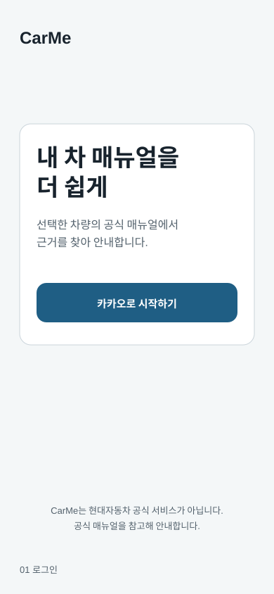

- CarMe 독자 서비스임을 먼저 밝힌다.
- 로그인 수단과 개인정보 처리 안내를 분리해 읽기 쉽게 둔다.

## 02. 차량 등록

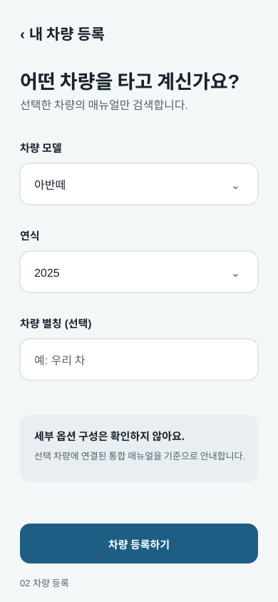

- 모델과 연식만 선택한다.
- 트림·세부 옵션을 받지 않으며, 통합 매뉴얼 기준이라는 고지를 노출한다.

## 03. 빈 상담방과 매뉴얼

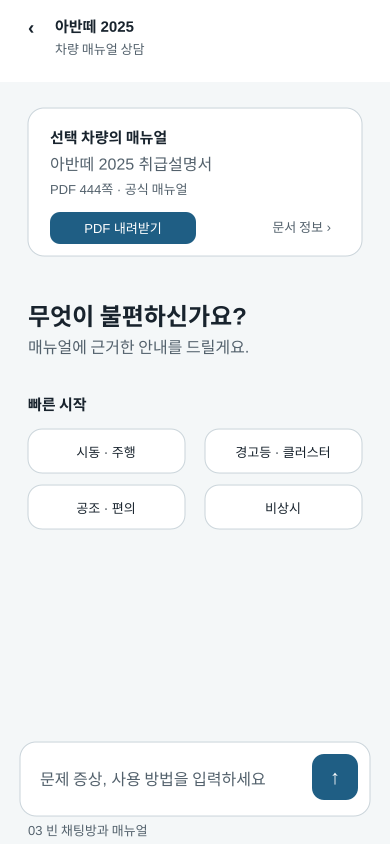

- 차량을 선택하면 질문 없이도 상담방을 만들고, 현재 연결된 `READY` 매뉴얼 정보를 표시한다.
- 적용 매뉴얼명과 PDF 다운로드 버튼을 즉시 보여 준다.
- 다운로드 클릭 시에만 짧게 만료되는 presigned URL을 요청한다. 원본 S3/MinIO URL은 노출하지 않는다.

## 04. 근거 있는 답변

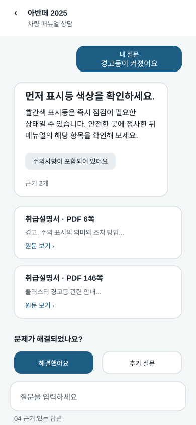

- 답변 바로 아래에 문서명과 `PDF n쪽`을 가진 근거 카드를 둔다.
- `원문 보기`는 현재 세션의 매뉴얼 download URL로 열며, 브라우저가 `#page`를 지원하지 않을 때에도 페이지 번호를 텍스트로 안내한다.
- LLM이 페이지 번호를 만들지 않고 서버가 검증된 citation으로 채운다는 원칙을 UI도 전제한다.

## 05. 추가 정보 요청

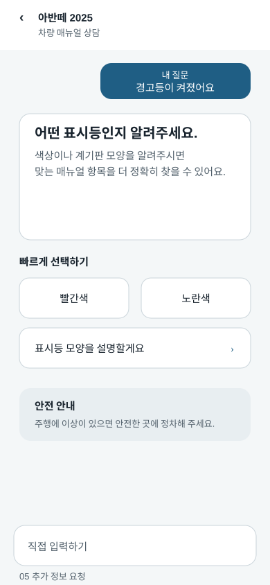

- 질문이 모호하면 추측 답변 대신, 다음 검색에 필요한 정보 한 가지만 질문한다.
- 빠른 선택과 직접 입력을 함께 제공하되, 답변보다 선택 행동이 먼저 보이게 한다.

## 06. 근거 부족

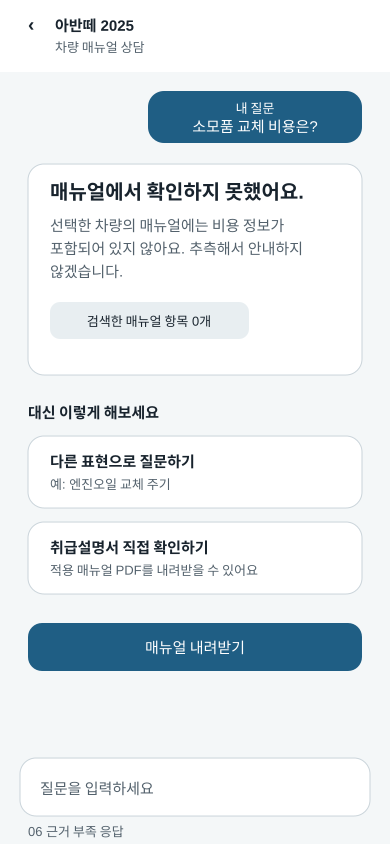

- 매뉴얼에서 찾지 못했음을 명확히 알리고 비용·정비 판단을 지어내지 않는다.
- 다른 표현으로의 재질문과 원문 매뉴얼 다운로드를 제공한다.

## 07. 안전 우선 안내

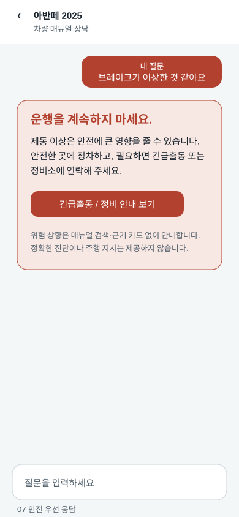

- 안전 관련 질문에서는 경고를 가장 위에 고정하고, 일반 설명보다 정차·공식 지원 경로를 우선한다.
- 실제 긴급 연락처와 지원 링크는 운영 국가·제휴 정책이 확정된 뒤 연결한다. 현재는 임의 번호를 표시하지 않는다.
- 안전 전환에는 PDF citation·원문 보기 카드를 표시하지 않는다.

## 08. 상담 종료

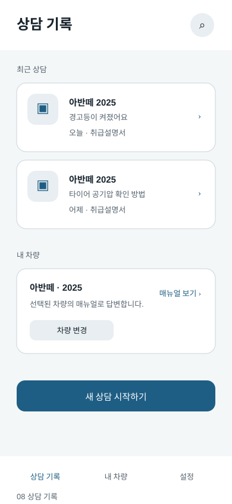

- 상담 내용은 저장되지 않으며, 채팅 화면을 나가면 현재 세션과 단기 기억이 즉시 삭제됨을 알린다.
- TTL 만료 또는 서버 재시작으로 종료되었을 때에도 이 화면을 표시하고 같은 차량으로 새 세션을 만든다.

## 09. 관리자 차량 카탈로그

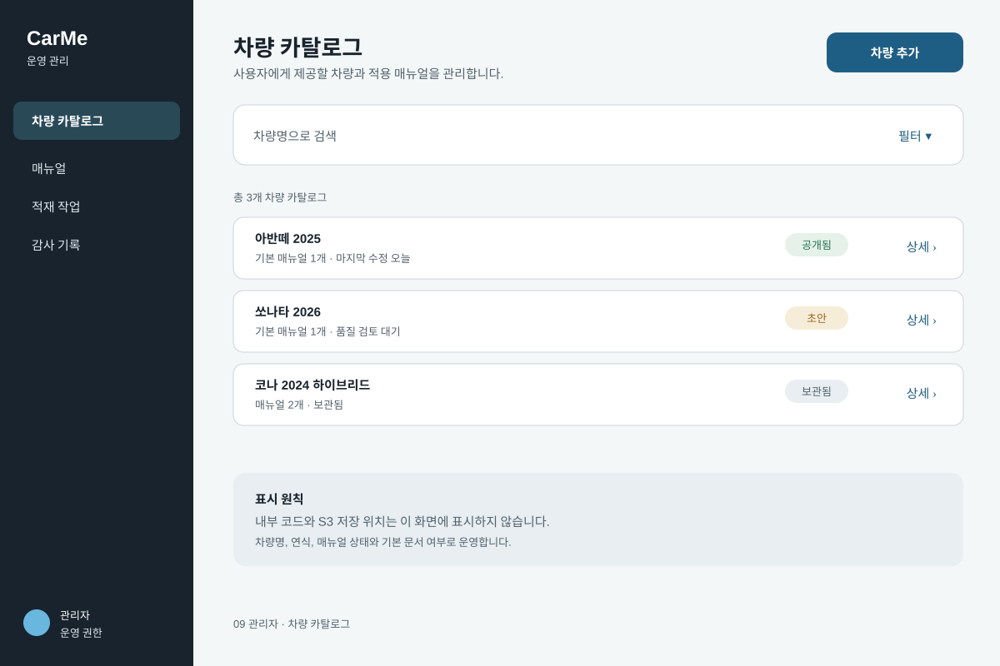

- 관리자가 생성·관리하는 단위는 사용자가 실제로 고르는 `vehicle_catalog` 행이다. `model_name`과 `model_year`은 별도 값으로 저장한다.
- `CN7_2025`처럼 내부 코드가 아니라 `아반떼 2025`라는 표시명, 공개 상태, 준비된 매뉴얼 수로 보여 준다.
- `DRAFT`, `ACTIVE`, `ARCHIVED`를 구분하고, 목록에서 바로 공개하지 않는다.

## 10. 관리자 매뉴얼 업로드

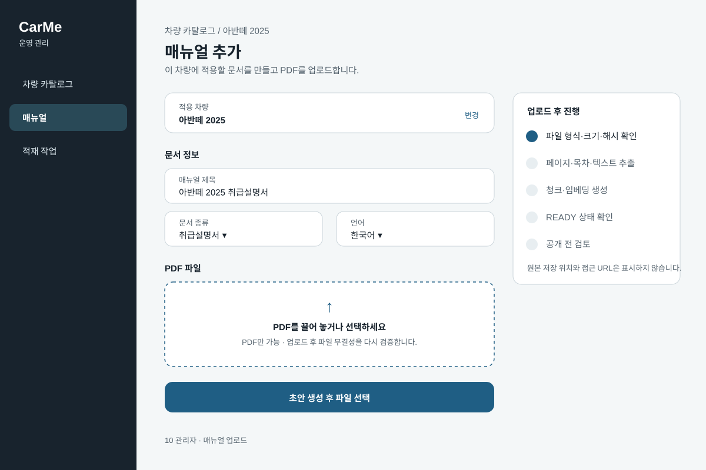

- 적용 차량을 먼저 연결한 뒤, 매뉴얼 초안을 만들고 PDF를 업로드한다.
- 브라우저는 짧게 만료되는 한 파일 전용 PUT URL만 사용한다. object key·bucket·장기 자격증명은 어떤 화면에도 노출하지 않는다.
- 업로드 완료는 공개가 아니다. 서버 검증과 worker 적재·평가 단계가 끝날 때까지 `DRAFT`/`UPLOADED`/`INDEXING` 상태를 보여 준다.

## 11. 관리자 공개 전 검토

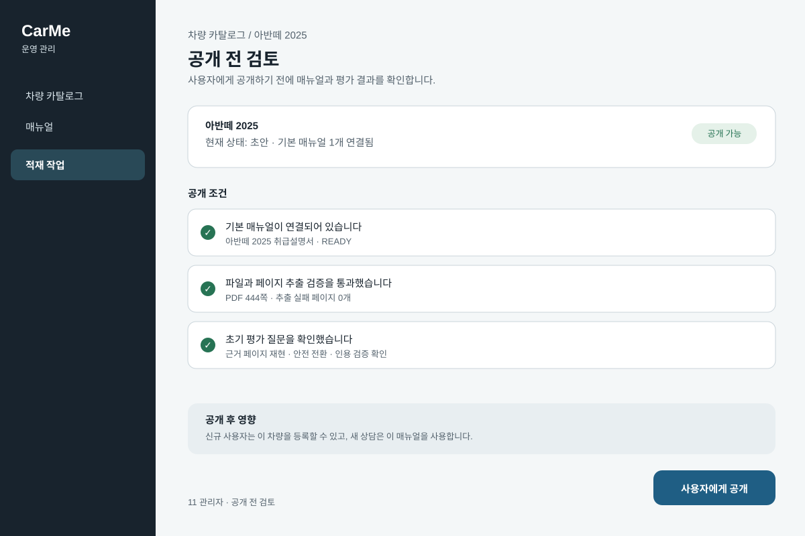

- 기본 `READY` 매뉴얼과 파일/페이지 검증, 매뉴얼 평가 세트 통과가 끝나야 `ACTIVE` 버튼을 활성화한다. 초기 평가 결과 테이블은 만들지 않고 수동 검토/스크립트 결과를 운영 산출물로 보관한다.
- `READY` 문서를 수정해 재색인하지 않는다. 개정 PDF는 새 매뉴얼로 적재한 뒤 연결을 변경한다.
- 공개·보관·매뉴얼 연결 변경은 초기에는 구조화 애플리케이션 로그에 남긴다.

## 구현 전 확인 항목

- [ ] Vue Router의 화면 경로와 8개 화면 상태를 매핑한다. 채팅 route leave에서 세션 삭제를 호출한다.
- [ ] 공통 `ManualHeader`, `CitationCard`, `ChatComposer`, `AnswerState` 컴포넌트 경계를 정한다.
- [ ] `GROUNDED`, `AMBIGUOUS`, `INSUFFICIENT_EVIDENCE`, `SAFETY_ESCALATION`을 서버 응답 상태값으로만 분기한다.
- [ ] PDF 다운로드와 citation 열기는 현재 세션 API가 반환한 presigned URL만 사용한다.
- [ ] 320px, dark mode, 긴 문서명·여러 citation에서 줄바꿈과 터치 영역을 점검한다.
- [ ] 관리자 desktop 기준(1,200px)과 좁은 화면에서 카탈로그·업로드·공개 검토 흐름을 점검한다.
- [ ] 사용자 화면과 관리자 화면 모두 내부 차량 코드·S3 object key·장기 자격증명을 표시하지 않는지 점검한다.
