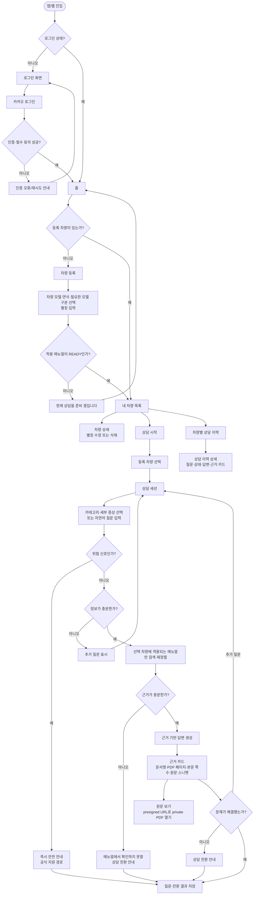

# CarMe 차량별 매뉴얼 상담 유저플로우

## 화면·상태 규칙

| 화면/상태 | 반드시 표시할 것 | 금지할 것 |
|---|---|---|
| 차량 등록 | 적재·검수된 모델·연식·모델 구분 선택, 별칭 입력 | 세부 옵션·트림 입력 요구 또는 실제 장착 여부 확정 표시 |
| 질문 입력 | 자유 텍스트, 카테고리, 차량 선택 상태 | 차량을 고르지 않은 상담 시작 |
| `AMBIGUOUS` | 한 번에 하나의 짧은 추가 질문 | 근거 없는 조치 안내 |
| `GROUNDED` | 답변, 각 근거 카드, 통합 매뉴얼·옵션 미판정 고지, 해결 여부 | 인용 없는 행동 지시 |
| `INSUFFICIENT_EVIDENCE` | 확인 불가 문구, 상담 전환 수단 | 그럴듯한 원인·해결책 생성 |
| `SAFETY_ESCALATION` | 일반 전환보다 우선인 안전 문구·공식 지원 경로 | 일반 RAG 답변, 해결 여부 질문으로 지연 |
| 원문 보기 | PDF 페이지와 본문 쪽수, 열기 실패 시 쪽수 안내 | public bucket URL·object key 노출 |
| 상담 이력 | 선택 차량의 질문·상태·답변·근거 | 다른 차량/다른 사용자의 이력 |

## 미결정 항목 — 구현 전 확정 필요

1. 안전 전환 문구, 공식 전화번호/외부 링크, 운영 시간
2. 차량 중복 등록 정책(권장: 같은 모델·연식·모델 구분은 한 대만 등록하고 별칭 수정)
3. 차량 삭제 시 상담 이력의 삭제·비식별 보존 여부
4. 카카오 access/refresh token 만료 시간 및 cookie 저장 방식
5. 고령 사용자를 위한 기본 글자 크기, 대비, 버튼 최소 높이, 오류 안내 문구
