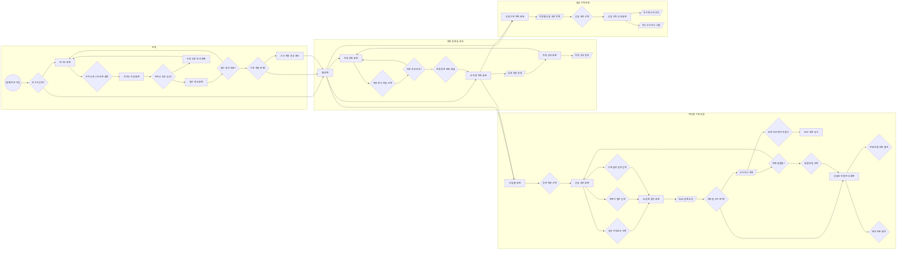

```mermaid
flowchart LR

  subgraph s1 ["인증"]
    n1(("앱/웹 최초 진입"))
    n2["로그인 화면"]
    n3{"카카오 로그인 버튼 클릭"}
    n4["카카오 인증 화면"]
    n5{"카카오 인증 성공?"}
    n6["필수 동의 화면"]
    n7{"필수 동의 완료?"}
    n8{"기존 계정 존재?"}
    n9["신규 계정 생성 처리"]
    n42["인증 오류 안내 화면"]
    n43{"로그인 상태?"}
  end

  subgraph s2 ["차량 등록 및 관리"]
    n10["홈 화면"]
    n11["차량 등록 화면"]
    n12{"차종·연식·트림 선택"}
    n13{"지원 차종 여부?"}
    n14{"차량 등록 완료 제출"}
    n15["내 차량 목록 화면"]
    n16[/"등록 차량 목록"/]
    n17["차량 상세 화면"]
    n18[/"차량 상세 정보"/]
  end

  subgraph s3 ["매뉴얼 기반 상담"]
    n19["상담 홈 화면"]
    n20{"등록 차량 선택"}
    n21["상담 세션 화면"]
    n22{"증상 카테고리 선택"}
    n23{"자연어 질문 입력"}
    n24{"구매 옵션 질문 입력"}
    n25["AI 답변 결과 화면"]
    n26[/"RAG 답변 요약"/]
    n27{"매뉴얼 근거 존재?"}
    n28[/"근거 카드 목록"/]
    n29{"원문 PDF 페이지 열기"}
    n30["PDF 원문 뷰어"]
    n31{"문제 해결됨?"}
    n32{"해결 안됨 선택"}
    n33["상담원 연결 안내 화면"]
    n34{"전화 연결 버튼 클릭"}
    n35{"예약 버튼 클릭"}
  end

  subgraph s4 ["상담 이력 조회"]
    n36["상담 이력 목록 화면"]
    n37[/"차량별 상담 세션 목록"/]
    n38{"상담 세션 선택"}
    n39["상담 이력 상세 화면"]
    n40[/"과거 메시지 내역"/]
    n41[/"과거 근거 카드 내역"/]
  end

  n1 --> n43
  n43 --> n10
  n43 --> n2
  n2 --> n3
  n3 --> n4
  n4 --> n5
  n5 --> n6
  n5 --> n42
  n42 --> n2
  n6 --> n7
  n7 --> n8
  n7 --> n2
  n8 --> n10
  n8 --> n9
  n9 --> n10
  n10 --> n11
  n10 --> n15
  n10 --> n19
  n11 --> n12
  n12 --> n13
  n13 --> n14
  n13 --> n11
  n14 --> n15
  n15 --> n16
  n16 --> n17
  n17 --> n18
  n17 --> n11
  n19 --> n20
  n20 --> n21
  n21 --> n22
  n21 --> n23
  n21 --> n24
  n22 --> n25
  n23 --> n25
  n24 --> n25
  n25 --> n26
  n26 --> n27
  n27 --> n28
  n27 --> n33
  n28 --> n29
  n29 --> n30
  n28 --> n31
  n31 --> n21
  n31 --> n32
  n32 --> n33
  n33 --> n34
  n33 --> n35
  n10 --> n36
  n36 --> n37
  n37 --> n38
  n38 --> n39
  n39 --> n40
  n39 --> n41
  n15 --> n19
  n15 --> n36
```
