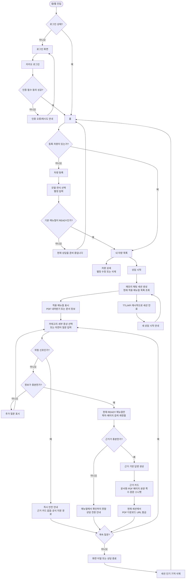

# CarMe 차량별 매뉴얼 상담 유저플로우

## 화면·상태 규칙

| 화면/상태 | 반드시 표시할 것 | 금지할 것 |
|---|---|---|
| 차량 등록 | 적재·검수된 모델·연식, 별칭 입력 | 세부 옵션·트림 입력·장착 여부 확정 |
| 빈 채팅 세션 | 적용 매뉴얼 제목, PDF 내려받기, 통합 매뉴얼 고지 | S3 원본 전체의 채팅 적재 |
| `GROUNDED` | 답변, 각 근거 카드, 옵션 미판정 고지 | 인용 없는 행동 지시 |
| `AMBIGUOUS` | 한 번에 하나의 추가 질문 | 근거 없는 조치 |
| `INSUFFICIENT_EVIDENCE` | 확인 불가·상담 전환 | 그럴듯한 원인·해결책 |
| `SAFETY_ESCALATION` | 우선 안전 문구·공식 지원 경로 | RAG 답변, PDF citation, 진단 |
| 원문 보기 | PDF/본문 쪽수, 열기 실패 시 쪽수 안내 | public URL·object key 노출 |
| 세션 종료 | 대화가 저장되지 않음, 새 세션 시작 | 과거 상담 재개·이력 UI |

## 구현 전 확정 필요

1. 안전 전환 문구, 공식 전화번호/외부 링크, 운영 시간
2. 같은 사용자·같은 모델·연식 중복 등록 정책(권장: 1대, 별칭 수정)
3. 카카오 access/refresh token 만료 시간과 cookie/CORS/CSRF 정책
4. 고령 사용자를 위한 글자 크기, 대비, 버튼 높이, 오류 문구
